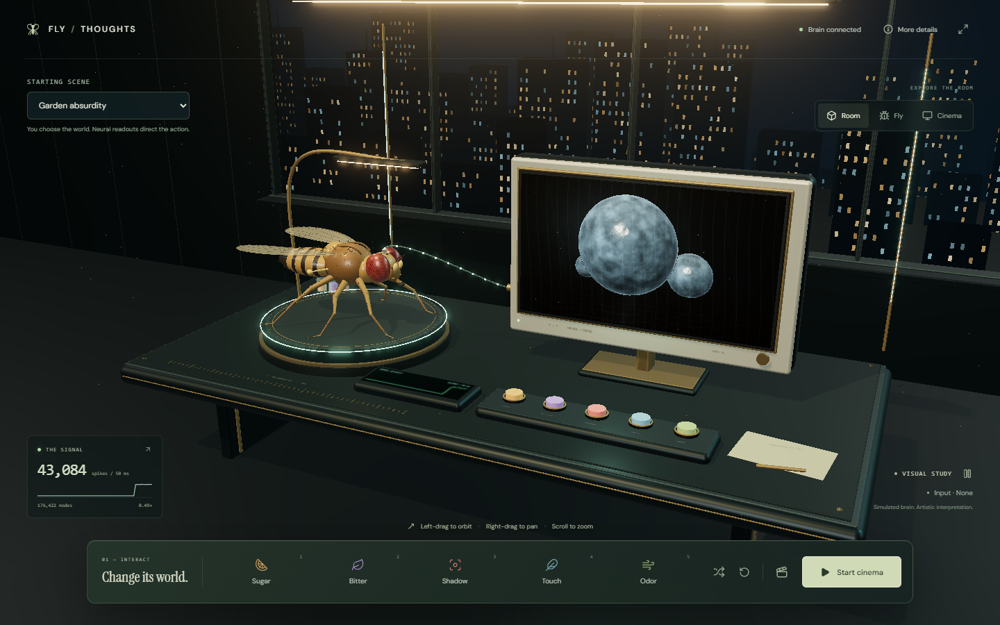
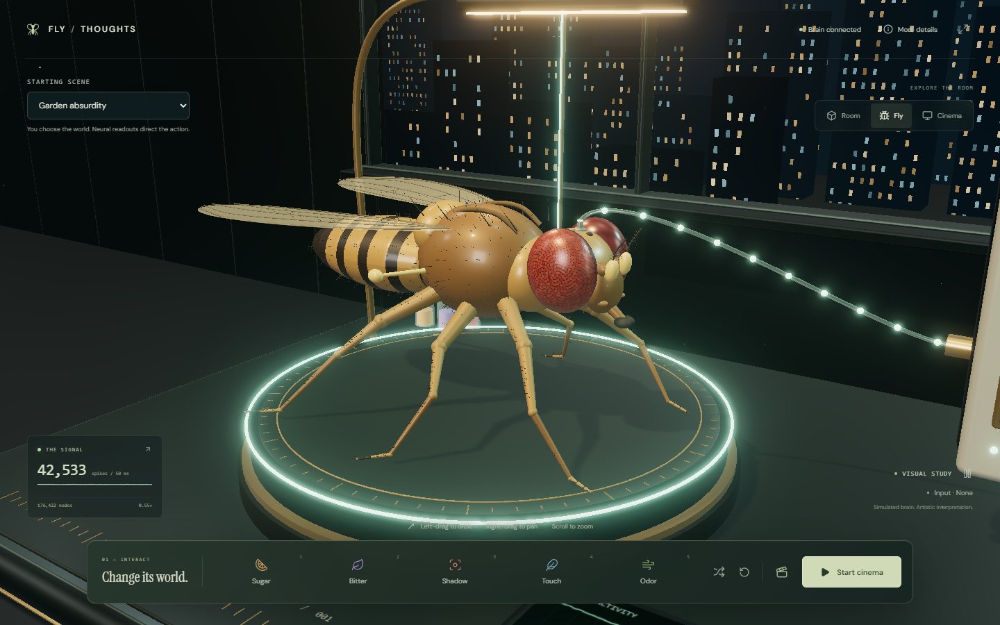
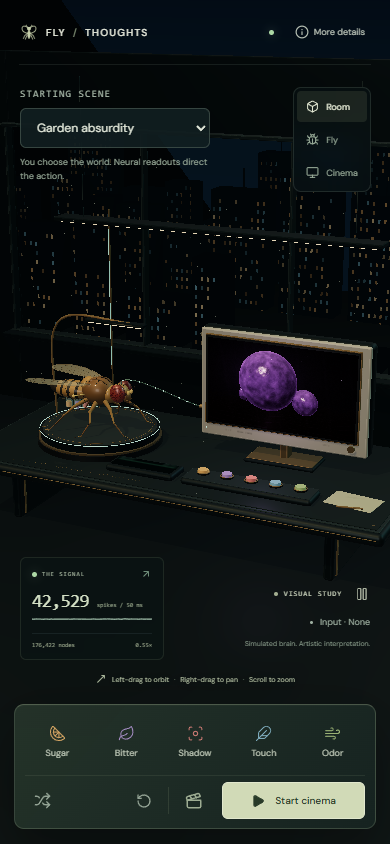

# Fly / Thoughts

A simulated fruit fly nervous system directing live video.

Fly / Thoughts connects a spiking neural network to an interactive Three.js laboratory and MiniMax H3 Director through fal. Give the model sugar, bitterness, a looming shadow, touch, or odor. The app reads the resulting neural activity and turns it into cinematic directions.

The premise is streaming a fly's thoughts. The implementation is a visualization of a computational model, not a recording of a living fly or a decoder of mental images. The network supplies behavioral readouts. We author the setting, visual metaphors, and cinematic style.



## How it works

1. A local Java process loads the bundled connectome and runs a leaky integrate-and-fire network.
2. The controls deliver inputs through the model's sensory encoders.
3. The bridge reports population firing rates, spike counts, and modeled motor outputs.
4. An authored mapping turns those readings into cinematic directions.
5. H3 generates a continuous video stream, displayed on the monitor inside the 3D scene.

```text
Stimulus -> sensory encoders -> spiking network -> measured readouts
                                                       |
                                                       v
                                          authored scene direction
                                                       |
                                                       v
                                            H3 via fal -> monitor
```

Generated frames do not feed back into the network. The simulated fly does not see or recognize the objects in the generated video. This is a neural-data-to-video experiment, not a closed-loop visual environment.

## Run locally

Requirements:

- Node.js 20.9 or newer and npm.
- A JDK 21 or newer, with `java` and `javac` on your PATH, or `JAVA_HOME` set.
- A browser with WebGL2. Chrome or Edge is useful for WebM recording.
- Memory for the network and browser. The brain launcher allows a Java heap of up to 4 GB.

From a checkout of this repository:

```sh
cd cinema
npm ci
npm run exhibit
```

Open [http://127.0.0.1:3000](http://127.0.0.1:3000).

The launcher starts the brain bridge on port 8766 and the web app on port 3000. It can reuse an already healthy bridge. Ctrl+C stops processes it started, but leaves a reused bridge running. The connectome is bundled, so no dataset download is needed.

Alternatively, run `npm run brain` and `npm run dev` in separate terminals, both from `cinema/`. The launcher compiles only the engine-independent Java classes needed by the exhibit.

### Enable generated video

Create `cinema/.env.local` using [cinema/.env.example](cinema/.env.example) as the template:

```dotenv
FAL_KEY=your_fal_key_here
BRAIN_URL=http://127.0.0.1:8766
```

Use your own fal key, then restart the web app. The key stays on the server and `.env.local` is ignored by Git. Never put it in a `NEXT_PUBLIC_` variable or commit it.

Choose a starting scene and select **Start cinema**. Opening the page does not start generation. A live session requires a connected brain and uses your fal account. **Stop cinema** ends it. The app limits a screening to three minutes using wall-time and generated-playback limits. Already dispatched generation can still incur charges. See the [provider's model page](https://fal.ai/models/minimax/h3-max/director) for pricing and availability.

Without a key, the monitor shows a local procedural visual study. It reacts to measured activity when the brain is connected. If the brain is offline, the buttons only change the preview and neural measurements are unavailable. The study is not H3 video and does not render the chosen live-video setting.

## Choose the world

Starting scenes are authored settings, not neural initial conditions. Choose one before starting cinema:

| Setting | Subject |
| --- | --- |
| Garden absurdity | A coiled dog dropping on a paving stone, filmed with excessive cinematic grandeur |
| Sugar cathedral | A large translucent sugar crystal on a kitchen counter |
| Overripe orchard | A split overripe plum in a miniature garden |

The setting establishes the subject. Measured responses direct the action. Feeding can add an approach, escape can drive a retreat, grooming can introduce foreleg cleaning, and locomotion or flight can move the viewpoint. Significant secondary feeding activity can affect a scene even when grooming remains the strongest output.

Sensory population activity can add declared visual cues, such as an overhead shadow or warm highlights. These are artistic conventions. Clicking a button alone does not establish that the corresponding neural response occurred. Lighting, environmental movement, and comic presentation are authored animation rather than neural measurements.

## Explore and interact

- **Left-drag** to orbit, **right-drag** to pan, and scroll to zoom. Room, Fly, and Cinema restore preset views.
- Click the physical desk buttons or use the matching controls. Keys **1 through 5** apply Sugar, Bitter, Shadow, Touch, and Odor.
- Inputs replace the previous input and expire in simulated time. A slow simulation takes longer in wall time.
- **Automatic stimuli** cycles through inputs. It does not script the network's responses.
- **Clear stimulus** removes external input while preserving recurrent activity.
- **More details** shows population rates, readouts, simulation speed, director timing, and translation options. **Reset neural state** starts a fresh trial and stops an active film.
- **Record 15 seconds** saves a 1600 x 900 WebM of the current 3D view. Click again to stop early. Live capture includes received audio and a visible interpretation label.



<details>
<summary>Mobile layout</summary>



</details>

These screenshots show the local procedural visual study. Generated video varies between sessions.

## What the measurements mean

The bundled data contains **176,422 neurons and 6,287,749 directed connections** from `male-cns:v1.0`. Connections with fewer than five synapses are excluded. This is a thresholded connectivity graph, not every synapse in the source dataset. See [PROVENANCE.md](PROVENANCE.md) for attribution, processing steps, and limitations, and [the build statistics](docs/connectome-stats.json) for exact counts.

The graph drives a simplified spiking model with configured neuron dynamics, sensory mappings, and motor decoding. Population rates are reported in Hz. Behavioral readouts are model scores, not probabilities of hunger, fear, or consciousness. Anatomical connectivity alone does not establish that this simulation reproduces a living fly's behavior or experience.

The fly mesh, idle motion, cable particles, and room are procedural artwork. Each cable particle does not represent an individual spike. Feeding output can trigger an approach to the chosen subject, but cannot tell us that a fly is imagining that subject.

## Timing and limitations

Live steering uses fresh neural samples rather than the local visual study's editorial hold. The default **Direct** translator builds prompts locally, without an LLM call. Changed direction signatures can be submitted at a minimum interval of 800 ms. Only one prompt awaits provider admission at a time; newer evidence replaces queued evidence. Steady scenes receive continuations about every 12 seconds.

**LLM assisted** mode is optional and can enrich steady continuations. Startup and measured changes still use the direct path. New evidence cancels obsolete enrichment.

A fast prompt submission does not mean an immediate visible response. Simulation speed, provider admission, generation, and buffering all contribute delay. Generated-chunk events do not timestamp the frame currently visible in the browser. H3 can also interpret a direction imperfectly, including producing unclear objects or weak motion.

This is a local research and creative demo. The app binds to loopback and uses a constrained server-side fal proxy. Publishing the source is different from public hosting, which would need authentication, per-user usage controls, and a review of the proxy and session boundaries.

## Project layout

| Path | Purpose |
| --- | --- |
| `cinema/components/theater.tsx` | Controls, scene selection, and session interface |
| `cinema/components/observatory.tsx` | Three.js renderer, camera, picking, and video texture |
| `cinema/lib/scene/` | Fly geometry, laboratory, city, and procedural screen |
| `cinema/lib/cinematic.ts` | Starting scenes and response-to-prompt mapping |
| `cinema/lib/use-director.ts` | fal stream lifecycle and neural steering |
| `cinema/lib/director-scheduling.ts` | Prompt admission, coalescing, and timing |
| `cinema/lib/use-recording.ts` | Browser WebM capture |
| `cinema/app/api/` | Local brain routes and server-side provider access |
| `src/main/java/com/fruitfly/brain/` | Neural model, encoders, and decoders |
| `src/main/java/com/fruitfly/brain/tools/CinemaBridge.java` | Headless HTTP bridge |
| `src/main/resources/connectome/` | Bundled connectome data |
| `tools/` | Data preparation and model utilities |

To add a starting scene, edit `INITIALIZATIONS` and `setScene` in `cinema/lib/cinematic.ts`. The server validates initialization identifiers against the same list. Keep the authored world separate from measured responses.

## Development checks

```sh
cd cinema
npm test
npm run typecheck
npm run build
```

The cinema suite covers stimulus observation, prompt scheduling, measured-response constraints, initialization selection, provider guards, and cable attachment. Provider tests use mocks and do not spend API credits. See [cinema/VALIDATION.md](cinema/VALIDATION.md) for verification scope.

## License and attribution

Code is licensed under [MIT](LICENSE). Bundled connectome data is attributed separately under **CC BY 4.0** in [PROVENANCE.md](PROVENANCE.md). Data credits include the FlyEM Project Team at HHMI Janelia, the University of Cambridge and MRC LMB connectomics groups, and Google Research Connectomics.

Generated video uses an external service and is subject to that service's terms. No API credentials are included in the repository.
