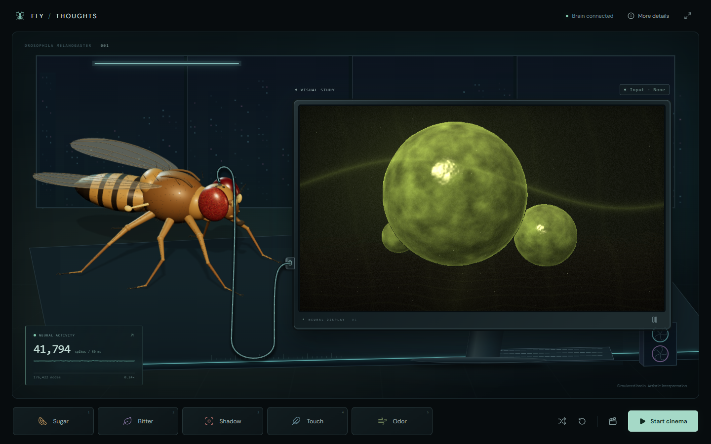

# FLY/THOUGHTS

An interactive cinema driven by a simulated fruit-fly nervous system.

A detailed procedural fly and a cinema screen share a dark, minimal stage, joined by a single cable anchored to the fly's head. Sugar, bitterness, a shadow, touch, and odor stimulate the existing connectome simulation. Measured neural activity becomes authored cinematic direction immediately; MiniMax H3 Director turns that direction into continuous surreal macro cinema. Optional LLM assistance adds variety between changes.



## Run it

Requirements: Node.js 20.9+ and a JDK 21+ available as `java` / `javac` (or `JAVA_HOME`). The connectome is already bundled in the parent repository.

```sh
cd cinema
npm install
npm run exhibit
```

Open **[http://127.0.0.1:3000](http://127.0.0.1:3000)**. The launcher starts the Java brain and the web app. If a healthy brain bridge is already listening on port 8766, it reuses that process without taking ownership of it. Press Ctrl+C to stop the processes started by the launcher; a reused brain keeps running.

The launcher loads the same local environment files as the web app. To use another brain port, set `BRAIN_URL=http://127.0.0.1:8767` in `.env.local`; the launcher starts or reuses the bridge at that address. The web app stays on port 3000. Stop an existing web app on that port before running the combined launcher.

Alternatively, use separate terminals:

```sh
npm run brain
npm run dev
```

The exhibit is immediately usable without an API key: the **procedural visual study** reacts to measured neural activity. With the brain offline, its controls change only the art study; neural measurements are explicitly unavailable. The local study is not generated by H3.

## Connect live cinema

If a key is not already configured, copy `.env.example` to `.env.local` and set `FAL_KEY`, then restart the web app. This key stays on the server. Select **Start cinema** to start an actual billed Director session with the connected brain. Starting the launcher or opening the page never starts a paid session automatically. **Cancel** stops a connecting session; **Stop cinema** ends a live session.

The default is 480p, 16:9, 24 fps, with 12 prompt-context segments. Each screening stops after 180 seconds of wall time from the first received media stream, or 180 seconds of cumulative generated playback, whichever application limit is reached first. Already dispatched work can still be billed. fal also applies its own session limit and minimum charge; check [current pricing](https://fal.ai/models/minimax/h3-max/director).

**A server key is configured in the development environment, but this revision has not been tested with actual paid fal generation.** The first paid screening still needs to verify actual WebRTC/ICE routing, video and audio delivery, and provider latency. See [VALIDATION.md](VALIDATION.md) for completed local checks and remaining verification.

This app binds to loopback and its fal proxy permits only the required WMA endpoints. It is intended for local use. Add real application authentication and per-user quotas before adapting it for public hosting; content moderation and hiding the API key are not authentication.

## The experience

- Watch the fixed fly move with idle animation and measured activity: six articulated legs, compound-eye facets, antennae, bristles, and translucent veined wings. Its anatomy is a procedural artistic model.
- The midnight workstation adds a recessed city window, overhead light, cyan bench edge, keyboard and rotating equipment fans. These are decorative set details, not neural measurements. The monitor edge identifies the active stimulus or last selected input; cinematic directions do not cover the picture or appear in recordings.
- Press the large **Sugar**, **Bitter**, **Shadow**, **Touch**, or **Odor** buttons, or use keyboard shortcuts **1–5**. Inputs replace the previous input and expire in **simulated** time, so a slow brain may take longer than wall time to finish a stimulus. A pending indicator remains until a fresh brain sample confirms the accepted input.
- Use the shuffle control, **Automatic stimuli**, for a repeating stimulus tour. The tour supplies inputs to the simulation; it does not manufacture neural outputs.
- Open **More details** for circuit evidence, population firing rates in Hz, simulation speed, prompt versions, buffer size, latency measurements, and the **Direct** / **LLM assisted** translation switch.
- **Clear stimulus** removes external input while preserving recurrent activity. **Reset neural state**, inside More details, creates a reproducible fresh trial and stops any current film.
- Use the fullscreen control for presentation; Escape exits fullscreen.
- **Record 30 seconds** exports a 1600 × 900 WebM composition with the fly, cinema, current neural state, and provenance label. During live video it includes the received audio. Click again to end and save early. Chrome or Edge recommended; export is WebM, not an MP4 transcoder.

## Response timing

The browser polls the brain every 150 ms, increasing to every 50 ms while waiting for a stimulus to appear in a fresh measured sample. The accepted sample is sent straight to the director and clears any previous scene hold. These intervals are polling targets, not guaranteed end-to-end reaction times; simulation speed and transport still contribute delay.

**Direct** is the default. Startup and measured changes use the authored translation locally, without waiting for an LLM. A changed motor drive or measured sensory motif can send a new direction after a minimum 800 ms between prompt submissions. Only one prompt awaits provider admission at a time; newer observations replace queued observations and are reconsidered when the pending prompt resolves. An unchanged scene receives a continuation about every 12 seconds, subject to the same admission gate. Merely clicking a stimulus never overrides the measurements.

**LLM assisted** optionally enriches steady continuations through Gemini 2.5 Flash Lite. Startup and changed measured evidence still take the direct path; a new change cancels obsolete enrichment. Failed enrichment uses the authored direction with a visible notice.

H3 generates and buffers video chunks. Replanning affects the next undispatched chunk, so a quick prompt update cannot replace video already generated or in flight. More details separates the accepted and latest generated prompt versions. Its observed-to-send, send-to-accept, and send-to-generation timings start from the relevant measured evidence and local SDK events. They do **not** measure button-to-photon latency or identify the exact frame currently displayed by the browser.

## What is real, and what is interpretation?

```text
UI stimulus → existing sensory encoders → full bundled LIF network
                                              ↓
                                  actual population / motor activity
                                              ↓
                                 authored cinematic interpretation
                                              ↓
                                        H3 Director → screen

Optional steady-scene enrichment: measured evidence → Gemini Flash Lite
                                                   → constrained direction
```

The bridge runs all 176,422 imported graph nodes and 6,287,749 directed connections in the bundled MaleCNS v1.0 derivative. The public release marks 165,122 nodes as traced; other graph nodes have other reconstruction statuses. See the parent [PROVENANCE.md](../PROVENANCE.md).

The existing model calibration remains unchanged: 0.5 ms integration, gain 0.65, Kenyon-cell gain 0.25. It uses the existing sensory encoders and motor decoder. Looming includes the existing analytical LC4/LPLC2 drive; this is not a claim that visual looming detection emerges from the retinal network. Neurons are simplified, weak connections are omitted, and the release itself has incomplete reconstruction coverage.

**This does not decode consciousness, thoughts, or the subjective experience of a living fly.** Measured simulated motor outputs select the film's movement. Measured odor and bitter receptor activity can supply additional visual motifs. The giant nectar planets, crystal reflections, captions, camera movement, and story are artistic choices. A selected stimulus alone does not establish the corresponding behavior.

`prompt_applied` means accepted direction, and a `chunk` event identifies generated output. These versions are available in More details; the latest generated version does not claim to be a browser frame timestamp. The main screen's stimulus indicator identifies user input, not the content of the currently displayed video frame.

### Initial neural state

Starting the brain process loads the bundled graph, sets every membrane potential to −52 mV, and initializes synaptic currents, pending spikes and activity counters to zero. The Poisson stimulation RNG starts with seed 20260903. Synaptic effects use connection counts and neurotransmitter signs with the existing model calibration; the graph does not supply a saved voltage state, experiences or memories.

The sensory frame begins with constant ambient luminance 0.6, which drives photoreceptors and the lamina pathway. The engine advances in 0.5 ms steps and publishes 50 ms windows. Button presses add specific sensory inputs to this already running network. Opening the cinema attaches H3 to the current readout; it does not initialize the brain. **Reset neural state** recreates the network, encoders and motor decoder with the same seed and calibration. **Clear stimulus** preserves that state and the ambient visual input.

To make brief neural bursts legible, scene direction may hold an exact observed sample for up to three seconds. Stronger measured responses can take over sooner. The sample's original timestamp and measurements are preserved; More details shows its age while held. Spike counts, population rates, and the fly's activity animation continue to use the current raw sample. A freshly observed accepted stimulus, reset, and disconnection clear this scene memory immediately.

The optional LLM is constrained by the measured motor drive and evidence; it can enrich the artistic scene, not invent neural measurements. Brain disconnection stops both live and connecting sessions.

## Code map

| File | Responsibility |
|---|---|
| `components/theater.tsx` | Exhibit, controls, details, setup, fullscreen |
| `components/fly-specimen.tsx` | Three.js anatomy, idle movement, and measured activity animation |
| `components/signal-cable.tsx` | Single cable between the projected brain anchor and screen |
| `components/room-details.tsx` | Responsive decorative workstation, also captured in recordings |
| `components/dream-study.tsx` | Local shader artwork; explicitly a visual study |
| `lib/use-brain.ts` | Bridge polling and confirmation of stimuli through fresh measurements |
| `lib/scene-selection.ts` / `lib/use-scene-evidence.ts` | Bounded scene hold with preserved evidence |
| `lib/cinematic.ts` | Declared mapping from measurements to cinematic direction |
| `lib/director-scheduling.ts` | Prompt admission, changed-scene cadence, and latency accounting |
| `lib/use-director.ts` | Direct translation, optional enrichment, session lifecycle, stop and cleanup |
| `app/api/director/route.ts` | Direct translation API and optional server-only LLM enrichment |
| `app/api/fal/proxy/route.ts` | Narrowly scoped WMA signaling proxy |
| `lib/use-recording.ts` | Canvas composition and WebM capture |
| `../src/main/java/com/fruitfly/brain/tools/CinemaBridge.java` | Actual headless neural simulation and local HTTP API |

## Checks

```sh
npm run typecheck
npm test
npm run build
```

From the parent repository, `./gradlew test` includes bridge validation and reset/order tests alongside the existing brain tests. No test starts a paid model session. The browser and full-connectome checks performed during development are recorded in [VALIDATION.md](VALIDATION.md).

## Attribution

MaleCNS data: FlyEM at HHMI Janelia, University of Cambridge, MRC LMB and Google Research; CC BY 4.0. [Original release](https://male-cns.janelia.org/). All procedural visual assets are generated locally by this app. Source code inherits the parent repository's MIT license; dependencies retain their own licenses.
